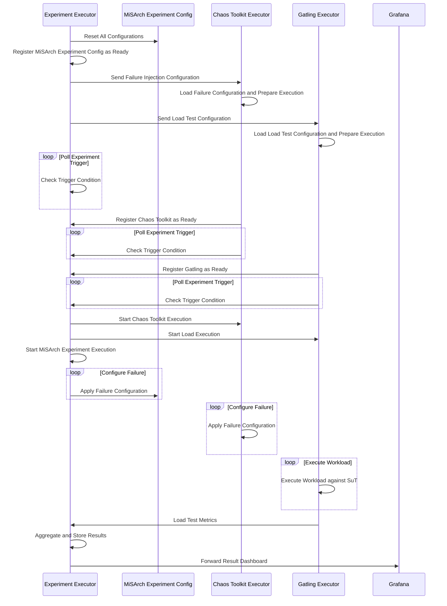

# Experiment Executor Service

The Experiment Executor is the core component of Ceres.
It is responsible for (1) the creation and storage of experiments, (2) the execution of stored experiments by calling the executor components at
the correctly scheduled time, (3) the collection and transformation of the Gatling metrics, and (4) the creation of the final Grafana dashboard and the report.

## API

The Experiment Executor exposes the following REST API endpoints to manage and execute experiments.

#### Experiment Management

- `POST /experiment/generate` - Generate a new experiment with a new UUID
- `GET /experiment/list` - List all experiments with their versions
- `GET /experiment/{testUUID}/versions` - List all versions of a specific experiment
- `POST /experiment/{testUUID}/{testVersion}/newVersion` - Create a new version of an existing experiment
- `DELETE /experiment/{testUUID}` - Delete an experiment with all its versions
- `DELETE /experiment/{testUUID}/{testVersion}` - Delete a specific version of an experiment

#### Configuration

- `GET /experiment/{testUUID}/{testVersion}/chaosToolkitConfig` - Get the Chaos Toolkit configuration of a specific experiment version
- `PUT /experiment/{testUUID}/{testVersion}/chaosToolkitConfig` - Update the Chaos Toolkit configuration of a specific experiment version
- `GET /experiment/{testUUID}/{testVersion}/misarchExperimentConfig` - Get the MiSArch Experiment Config of a specific experiment version
- `PUT /experiment/{testUUID}/{testVersion}/misarchExperimentConfig` - Update the MiSArch Experiment Config of a specific experiment version
- `GET /experiment/{testUUID}/{testVersion}/gatlingConfig` - Get the Gatling configuration of a specific experiment version
- `PUT /experiment/{testUUID}/{testVersion}/gatlingConfig` - Update the Gatling configuration of a specific experiment version
- `GET /experiment/{testUUID}/{testVersion}/config` - Get the global experiment configuration of a specific experiment version
- `PUT /experiment/{testUUID}/{testVersion}/config` - Update the global experiment configuration of a specific experiment version

#### Execution

- `POST /experiment/start`
- `POST /experiment/{testUUID}/{testVersion}/start` - Start the execution of a specific experiment version
- `POST /experiment/{testUUID}/{testVersion}/stop` - Stop the execution of a specific experiment version
- `GET /experiment/{testUUID}/{testVersion}/events` - Register for server-sent events to get experiment execution updates

#### Synchronization & Metrics

- `POST /trigger/{testUUID}/{testVersion}` - Register a component (Gatling Executor, Chaos Toolkit Executor, MiSArch Experiment Config) as ready
- `GET /trigger/{testUUID}/{testVersion}` - Poll if the experiment can start
- `POST /experiment/{testUUID}/{testVersion}/gatling/metrics/steadyState` - Forward steady-state metrics from Gatling Executor

## Technology Stack

- **Language**: Kotlin
- **Framework**: Spring Boot
- **Asynchronous Processing**: Spring WebFlux + Kotlin Coroutines

## Repository Structure

The repository is structured as follows:

- `/src/`: Source code of the service
  - `config`: Package that includes several configuration classes
  - `controller/`: Package that includes all REST controllers
    - `experiment/`: Different controllers for the experiment lifecycle
  - `service/`: Package for all service classes containing the actual business logic
  - `model/`: Package that includes the main data model
    - `ExperimentCofig`: The global experiment configuration schema
  - `plugin`: Package that includes all plugin classes for the different technologies
    - `export`: Plugins for Grafana export, LLM export and report generation
    - `failure`: Plugins for failure execution with Chaos Toolkit Executor and MiSArch Experiment Config
    - `workload`: Plugin for Gatling Executor workload execution
    - `metrics`: Plugins for metrics transformation and storage from Prometheus and Gatling

## Experiment Execution Process

The following steps describe the workflow that is executed when an experiment is started.

### Starting an Experiment

- Initiation:
  - Start via API call or UI button.
  - Loads experiment configuration from persistent storage.
  - If no execution for the same version is running, a temporary state is created in memory.
- Component Preparation:
  - Sends HTTP requests:
    - Failure configuration → Chaos Toolkit Executor
    - Workload configuration → Gatling Executor
    - Reset failures → MiSArch Experiment Config
  - Waits for all components to be ready.

### Synchronization & Registration

- Endpoints Provided:
  1. Register component as ready.
  2. Poll if experiment can start.
- Readiness:
  - All three components (Gatling Executor, Chaos Toolkit Executor, MiSArch Experiment Configuration) must register.
  - Polling every 100 ms; experiment starts when all are ready (max 300 ms diff).
- Scheduling:
  - Failure scheduling is handled by Experiment Executor.

### Special Handling

- Warm-up / Steady-State Hypothesis:
  - Gatling Executor runs these before registering as ready.
  - Metrics are forwarded to Experiment Executor for threshold calculation and goal storage.

### Execution Phase

- Start:
  - Timestamp is marked.
  - Failure injection is managed by Experiment Executor.
- Component Responsibilities:
- Chaos Toolkit Executor and Gatling Executor handle their respective tasks.

### Completion & Reporting

- Metrics Collection:
  - Gatling Executor sends HTML and JS metrics files.
  - Experiment Executor marks completion, clears state, and transforms metrics for InfluxDB.
- Report Generation:
  - Stores execution timestamps, goals, and threshold violations.
  - Optionally stores raw metrics and queries Prometheus for additional data.
- Dashboard Creation:
  - Grafana dashboard is parameterized and forwarded.
  - Frontend is notified via server-side events with dashboard URL.

### Stopping an Experiment

- Stop Endpoint:
  - Terminates MiSArch Experiment Configuration thread.
  - Calls stop endpoints for Gatling Executor and Chaos Toolkit Executor.
  - Clears experiment state.
